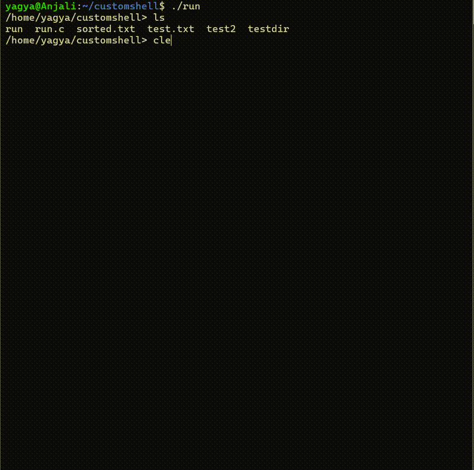

# CShell
A simple Unix-like shell written in C. Supports basic commands, I/O redirection, and process handling.

## Features
- Run external commands (e.g. `ls`, `echo`, `cat`)
- Input and output redirection (`<` and `>`)
- Supports pipes (`|`)
- Handles Ctrl+C (SIGINT) gracefully

## Roadmap
- Background jobs (&)
- Job control with `fg`, `bg`
- Environment variables
- Command history
- Better signal handling (SIGCHLD, SIGTSTP)

## 🔧 Build & Run
Clone the repository:
```bash
git clone https://github.com/ojha2/cshell.git
gcc -o run run.c
./run
```


